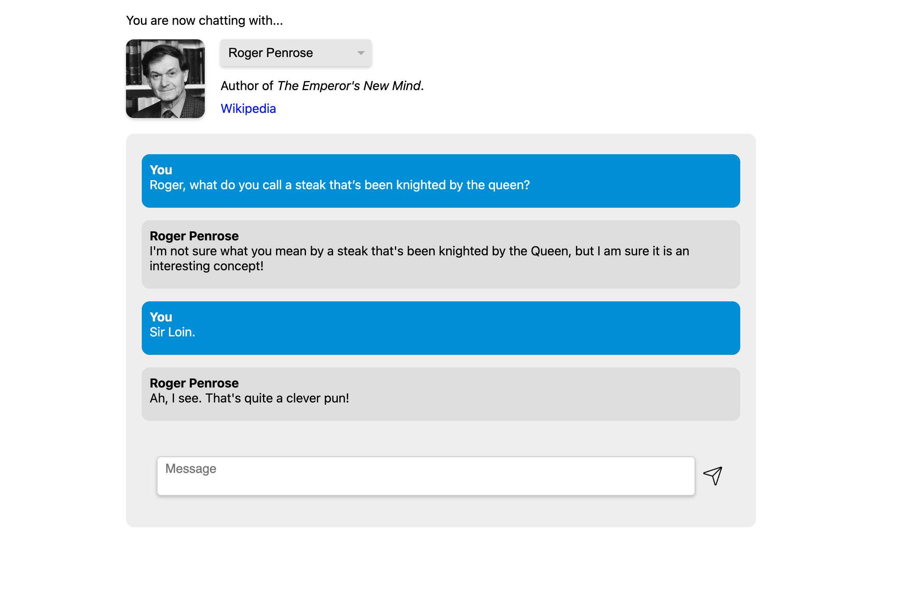

## Background
Created this as a final project in CSE 490: Philosophy of AI at UW. It utilizes GPT-3 (text-davinci-003) to create text-based representations of five different authors whose work we studied in class, allowing users to chat with these GPT-powered versions of the authors.



## Getting Started

First, run the development server:

```bash
npm run dev
# or
yarn dev
```

Open [http://localhost:3000](http://localhost:3000) with your browser to see the result.